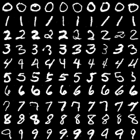
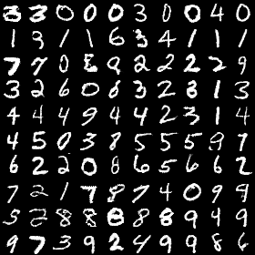
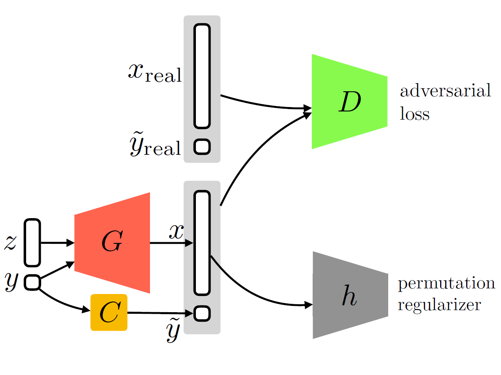
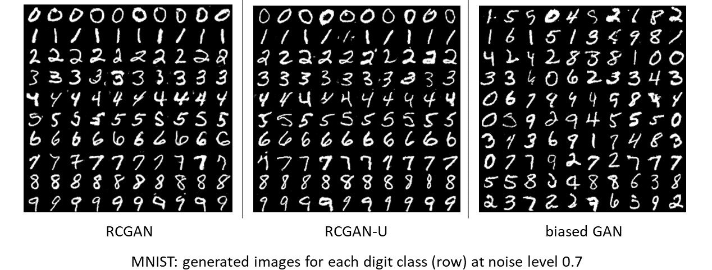
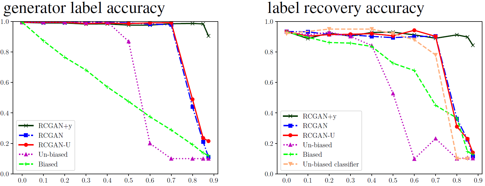
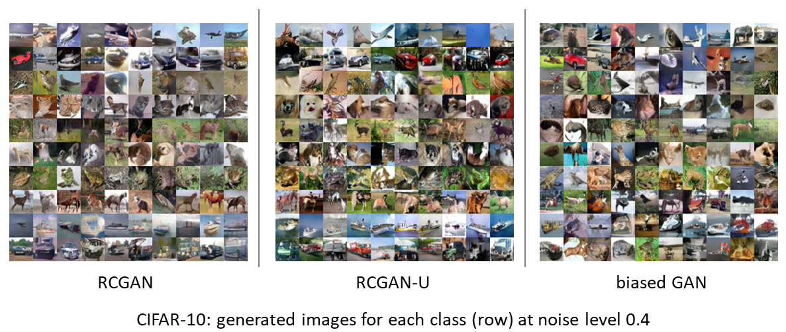
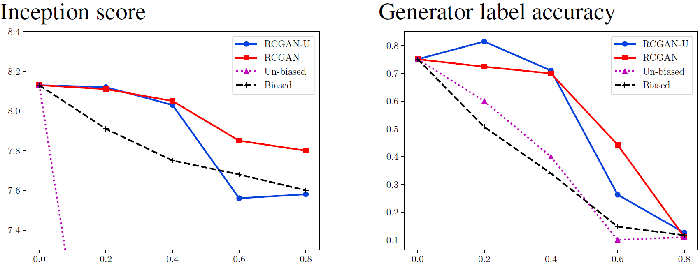

# Robust Conditional GAN - RCGAN (Train cGAN using noisy labels)

This repo gives a brief introduction and the code to reproduce the experiments of our paper: 
[*Kiran Koshy Thekumparampil, Ashish Khetan, Zinan Lin, and Sewoong Oh. Robustness of conditional GANs to noisy labels, NIPS 2018*](https://arxiv.org/abs/1811.03205).

A variant of GAN that is popular in many practical applications is the [**conditional GAN (cGAN)**](https://arxiv.org/abs/1411.1784), where the input examples are labelled and the goal is to generate realistic examples conditioned on the label chosen by the end-user. That is, given a set of samples **{(xi, yi)}** from distribution **P(X,Y)**, cGAN should learn to sample from the conditional distributions **P(X|Y=y)**, for any **y**.

For example, the MNIST dataset of hand written digit images, **{xi}**, is divided into 10 classes (0-9), according to the digit the image represents. Using these images **{xi}**, and their corresponding class labels (digits) **{yi}**, we can then train a cGAN to generate hand written digits for any digit in **{0,1,...,9}**. In the figure below, we show ten images generated by a cGAN for each digit class (row).

One of the merits of conditional GANs is that conditioning improves sample quality. Empirical evidences in the literature show that conditional GANs achieve better image quality compared to the (unconditioned) GANs trained on the same data but without the labels. 

### Noisy labeled real examples

Due to either human errors in annotation or malicious adversaries, labels might be corrupted. If we train a cGAN using these noisy labels, as expected, the generated samples are biased. For example, if we randomly and uniformly corrupt the true labels with a chance of 50%, we see that the trained cGAN on such a data will only produce the correct digit only 50% time as show in the figure below.

Apart from the bias in the generated examples, we note the decline in the quality of these samples as compared to the noise-less case.

#### **Disadvantages of training with noisy labels**

1. Samples are biased, generating examples from wrong classes. 
2. Samples quality degrades with noise.

### Goal

Can we make cGAN training robust against noise in the labels? 

## Our contributions

### Robust condition GAN (RCGAN)

We propose RCGAN architecture when we know the noise model **C** which corrupted the real labels. In RCGAN, before passing the samples **(x, y)**  generated by the generator **G**, to the discriminator **D**, we pass the generated label **y** through the same noisy channel **C** to corrupt them. Effectively, the adversarial loss **D** minimizes the distance between the distributions of real noisy samples and generated noisy samples. In the paper we prove that under-certain assumptions on the discriminator RCGAN learns the noiseless "true" conditional distributions.

### RCGAN with Unknown noise model (RCGAN-U)

When the noise model **C**, is unknown we propose RCGAN-U, which has a similar architecture as that of RCGAN but, along with the generator **G**, the noise model **C** is learned as a parametric model. For identifiability of **C**, we add the permutation regularizer to the architecture. 

### True label recovery (cGAN-label-recovery)

As an immediate application of RCGAN, we also use these learned cGANs to recover the hidden true real labels with high accuracy. We compare our recovery accuracy with a state-of-the-art [un-biased classifier](https://papers.nips.cc/paper/5073-learning-with-noisy-labels.pdf). 

## Results

In addition to the baseline biased GAN, we provide another baseline: un-biased GAN, which is inspired from [un-biased classifier](https://papers.nips.cc/paper/5073-learning-with-noisy-labels.pdf) (see our paper for details).  We see that our proposed RCGAN and RCGAN-U consistently beat the baselines in all metrics and sample quality.

### MNIST

For MNIST, we also propose another RCGAN variant named RCGAN+y, which has the same discriminator as that of RCGAN but additionally a one-hot representation of the label **y** is concatenated with the input to its first layer. RCGAN+y is challenging to train (see appendix of our paper for details).

In the following plots we chart:

1. *generator label accuracy*: rate at which the generator produces the correct digit, and,
2. *label recovery accuracy*: recovery accuracy of corresponding cGAN-label-recovery algorithm.

### CIFAR-10

In the following plots we chart:

1. [*inception score*](https://arxiv.org/abs/1801.01973): , and,
2. *generator label accuracy*: rate at which the generator produces the correct class.

## System prerequisites

- Linux or OSX
- python 3.5
- tensorflow 1.5
- numpy
- scipy

## Running the experiments

### Installation

Please download MNIST and CIFAR-10 dataset to the appropriate folders using the follow commands.

`python download mnist`

`python download cifar10`

Now you can use the following scripts to train different settings. All the scripts use only one GPU, but we have observed that using 2 GPUs can accelerate the training for CIFAR-10.

### MNIST

Code is adapted from https://github.com/carpedm20/DCGAN-tensorflow.
Before running the MNIST experiments make `mnist/` your current directory: `cd mnist/`

1. *RCGAN*:  `./run_rcgan.sh`
2. *RCGAN-U*:  `./run_rcganu.sh`
3. *RCGAN+y*: `./run_rcgany.sh`
4. *Biased GAN*: `./run_biased.sh`
5. *Un-biased GAN*: `./run_unbiased.sh`
6. *Ambient GAN*: `./run_ambient.sh`

### CIFAR-10

Code is adapted from https://github.com/watsonyanghx/GAN_Lib_Tensorflow.
Before running the MNIST experiments make `cifar10/` your current directory: `cd cifar10/`. 

1. *RCGAN*:  `./run_rcgan.sh`
2. *RCGAN-U*:  `./run_rcganu.sh`
3. *Biased GAN*: `./run_biased.sh`
4. *Un-biased GAN*: `./run_unbiased.sh`
